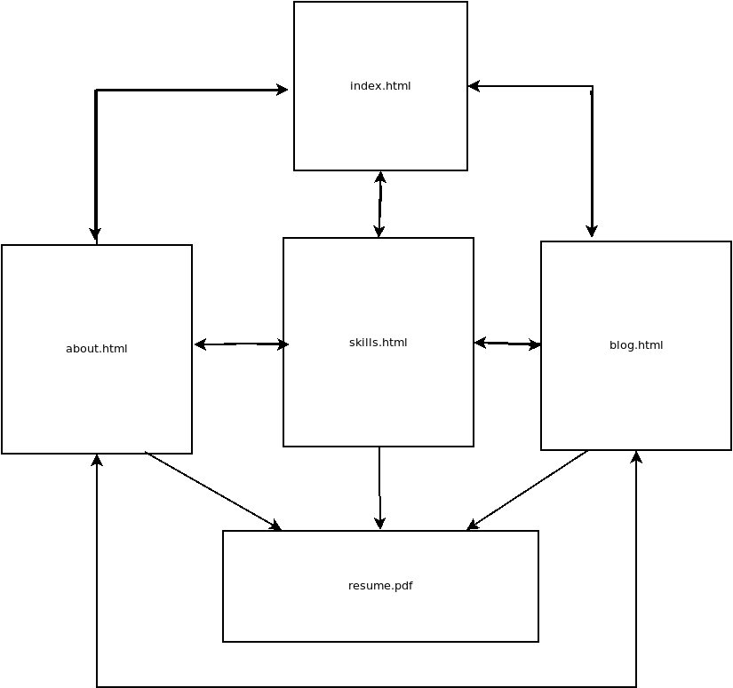

## Personal Portfolio

link to Portfolio: https://github.com/pmargan/pmargan.github.io/src

link to github repo: https://github.com/pmargan/PeterMargan_T1A3

### Purpose

To build a tool to showcase my personality and my skills to 
people in the industry and develop those skills deeper in a practical way.
This assignment has helped me to understand to understand how CSS-grid works as a two-dimensional layout tool. I have found CSS Flexbox display: flex; to be a attractive concept for centering elements and general positioning along the one axis. Through this assignment, I have found grid-template-rows and grid-template-areas to be a hugely powerful tool for layouts.

### Functionality / Features

This Portfolio is designed to be a four page hyperlinked layout without any javascripts. This site is pure HTML and CSS. Users can get to any page required via the handy "hamburger menu". Using the pure css dropdown.
There are convienient links to my social networks on top right of each page.
I have used flex box sparingly and css-grid extensively. 
I have imported fonts to get the right effects and images appropriate for the site.

### Target audience

Created for Fellow devs and potential recruiters.

### Tech Stack Used

Editor = vscode
languages used = HTML & CSS
used Imported graphics & fonts.

### Site Map

